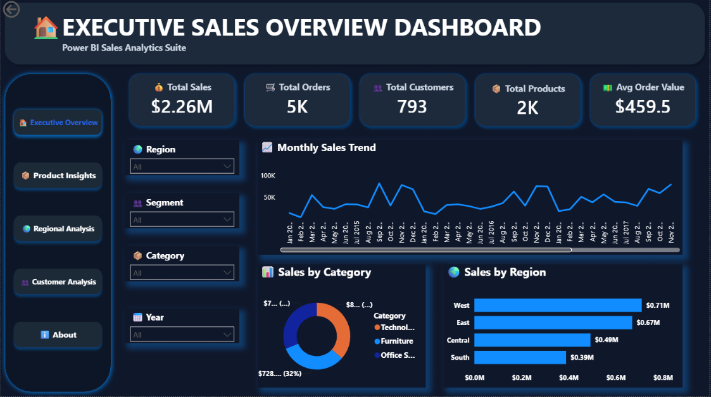
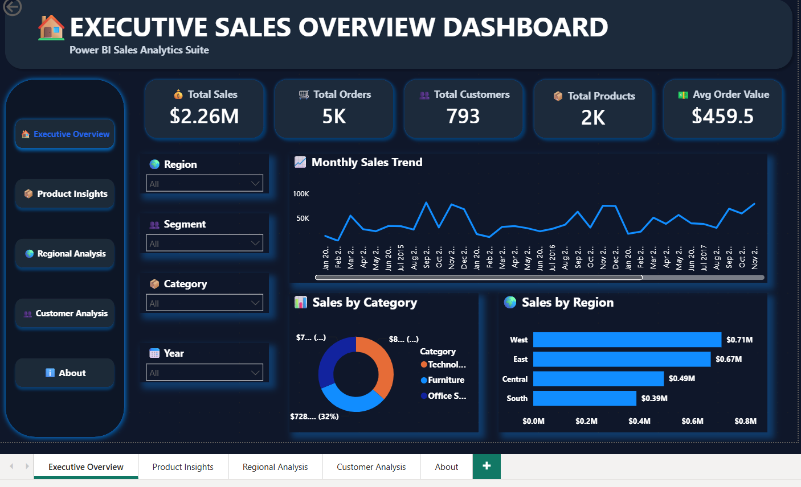
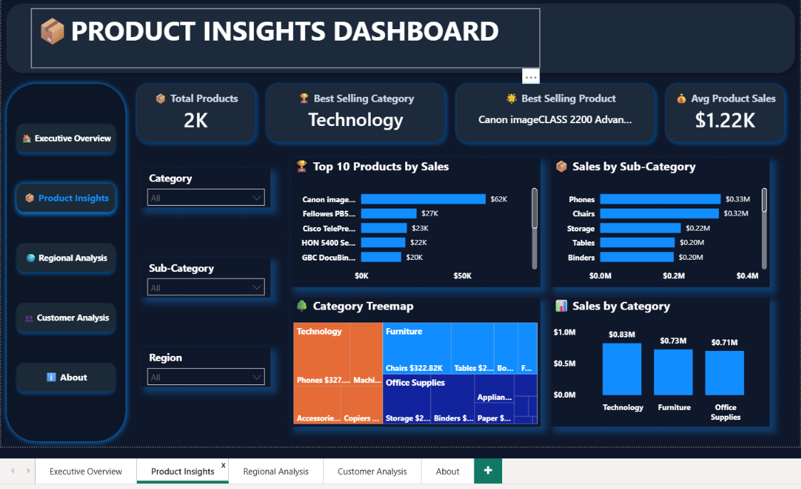
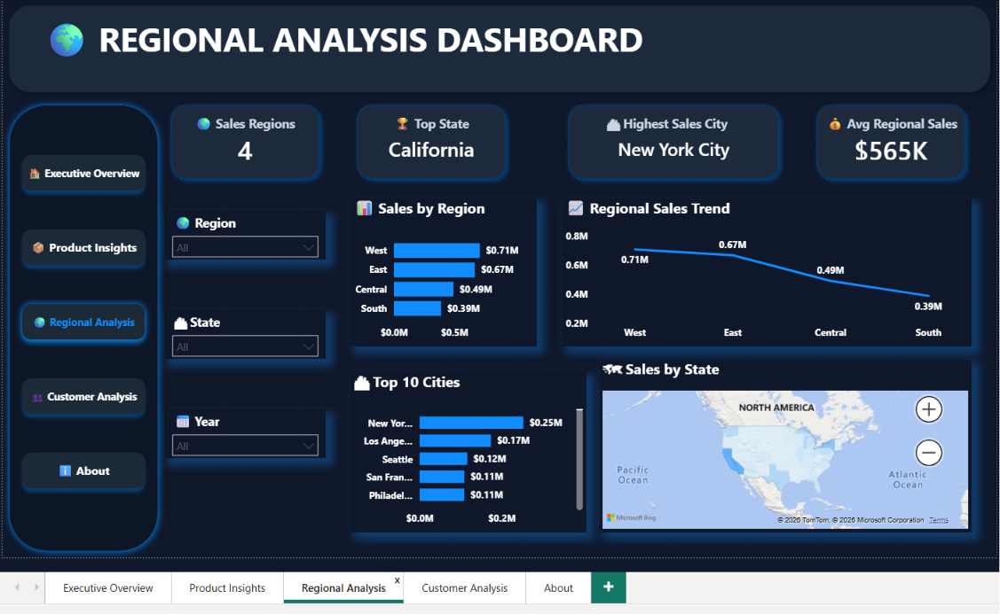
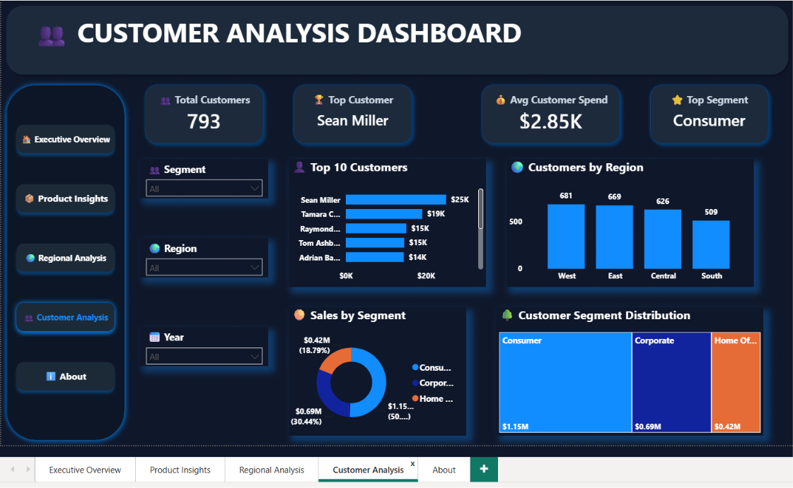
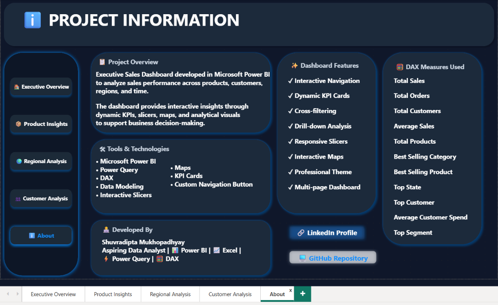

# 📊 Executive Sales Dashboard - Power BI



---

## 📌 Project Overview

The **Executive Sales Dashboard** is a multi-page interactive Power BI dashboard designed to provide business insights from the Superstore Sales dataset.

It enables users to analyze sales performance, product trends, customer behavior and regional performance through dynamic KPIs, interactive slicers and professional visualizations.

This project demonstrates dashboard design, data modeling, Power Query and DAX for business intelligence reporting.

---

# 🚀 Dashboard Pages

## 🏠 Executive Sales Dashboard

- Executive KPI Cards
- Monthly Sales Trend
- Sales by Category
- Sales by Region
- Interactive Slicers



---

## 📦 Product Insights Dashboard

- Product Performance KPIs
- Top 10 Products
- Sales by Sub-Category
- Category Treemap
- Category Comparison



---

## 🌍 Regional Analysis Dashboard

- Regional Performance KPIs
- Sales by State Map
- Sales by Region
- Top Cities
- Regional Distribution



---

## 👥 Customer Analysis Dashboard

- Customer KPIs
- Top Customers
- Sales by Segment
- Customers by Region
- Customer Distribution



---

## ℹ️ Project Overview Dashboard

- Project Documentation
- Dataset Information
- Technologies Used
- DAX Measures
- Dashboard Features
- Developer Information



---

# ✨ Dashboard Features

- Multi-page interactive dashboard
- Professional UI design
- Dynamic KPI Cards
- Interactive Navigation Buttons
- Cross-filtering visuals
- Interactive slicers
- Power Query data transformation
- DAX calculations
- Regional map visualization
- Business-focused analytics

---

# 🛠️ Tools & Technologies

- Microsoft Power BI
- Power Query
- DAX
- Microsoft Excel

---

# 📂 Dataset Information

| Property | Value |
|----------|-------|
| Dataset | Superstore Sales |
| Rows | 9,994 |
| Columns | 18 |
| Country | United States |
| Time Period | 2015–2018 |

---

# 📈 KPIs Created

- Total Sales
- Total Orders
- Total Customers
- Average Sales
- Total Products
- Best Selling Category
- Best Selling Product
- Sales Regions
- Top State
- Highest Sales City
- Average Regional Sales
- Top Customer
- Average Customer Spend
- Top Segment

---

# 💡 Business Insights

This dashboard helps answer important business questions such as:

- Which products generate the highest revenue?
- Which customer segment contributes the most sales?
- Which states and regions perform best?
- Who are the highest-value customers?
- How do sales change over time?
- Which product categories drive business growth?

---

# 📁 Repository Structure

```
Executive-Sales-Dashboard-PowerBI
│
├── Dashboard.pbix
├── Superstore_Sales_Dataset.xlsx
├── Dashboard_Preview.png
├── README.md
└── Assets
    ├── Executive_Overview.png
    ├── Product_Insights.png
    ├── Regional_Analysis.png
    ├── Customer_Analysis.png
    └── Project_Information.png
```

---

# 🎯 Skills Demonstrated

- Power BI Dashboard Development
- Business Intelligence
- Data Visualization
- Dashboard UI Design
- DAX
- Power Query
- Data Modeling
- KPI Development
- Interactive Reporting

---

# 👨‍💻 Developed By

### Shuvradipta Mukhopadhyay

**Aspiring Data Analyst**

**Skills**

- 📊 Power BI
- 📈 Excel
- ⚡ Power Query
- 🧮 DAX

### Connect with Me

- 💼 LinkedIn
- 💻 GitHub

---

